# DirScanner Framework Architecture

## Executive Summary

The DirScanner framework represents a sophisticated transformation from a single-purpose torrent scanner into a **multi-dimensional plugin-based architecture** that demonstrates enterprise-grade design patterns and principles. The architecture implements a **two-axis separation strategy** that provides both horizontal scalability (core framework → business logic plugins) and vertical scalability (business logic → transport layers), enabling true **channel-agnostic** design.

This architectural approach ensures that the same business logic can be accessed through multiple channels (CLI, REST API, gRPC, event-driven systems) without code duplication or tight coupling, making it suitable for enterprise environments where consistent functionality across multiple interfaces is critical.

## Architectural Perspectives

### 1. Logical View - Plugin-Based Separation

The logical architecture demonstrates clear **bounded contexts** and **separation of concerns**:

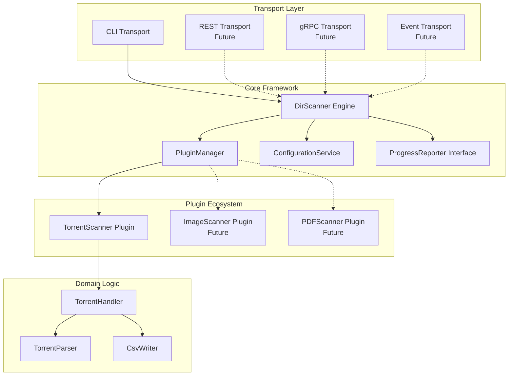

**Key Principles:**
- **Plugin Isolation**: Each plugin is a separate bounded context
- **Framework Core**: Provides common services without business logic coupling
- **Transport Independence**: Business logic accessible from any transport layer

### 2. Development View - Module Structure

The development view shows the Maven modular structure that supports the logical separation:

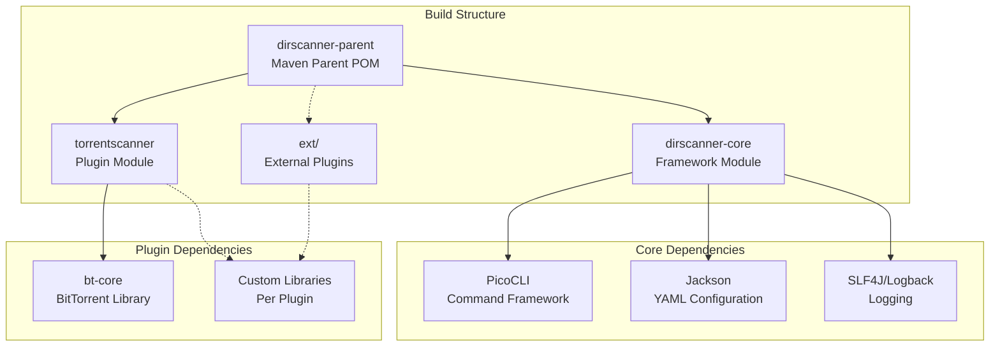

**Benefits:**
- **Dependency Isolation**: Plugins don't pollute core framework with domain-specific libraries
- **Independent Deployment**: Plugins can be developed and deployed separately
- **Version Management**: Centralized dependency management with plugin autonomy

### 3. Process View - Plugin Lifecycle and Scanning Operations

The process view illustrates how the framework orchestrates plugin discovery, initialization, and execution:

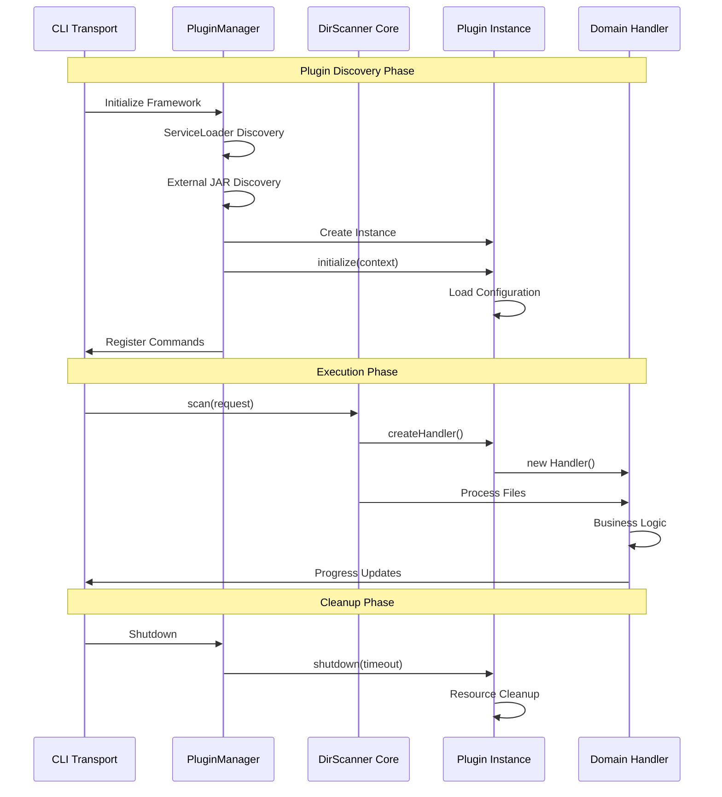

**Key Characteristics:**
- **Lifecycle Management**: Proper initialization and cleanup
- **Error Isolation**: Plugin failures don't crash the framework
- **Resource Management**: Timeout-based cleanup prevents hanging

### 4. Physical View - Deployment Models

The physical architecture supports multiple deployment scenarios:

#### Build-Time Integration
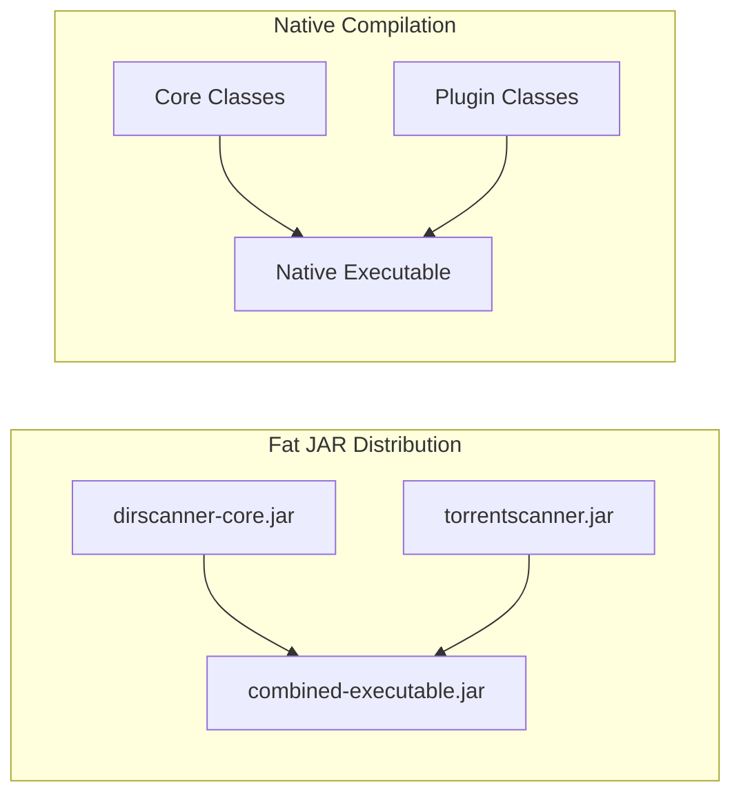

#### Runtime Plugin Loading
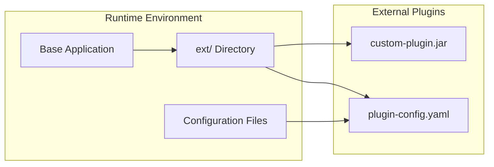

**Deployment Flexibility:**
- **Fat JAR**: Maximum compatibility, single file distribution
- **Native Binary**: Fast startup, reduced memory footprint
- **Plugin Directory**: Dynamic loading, no restart required

### 5. Channel Agnostic Design - Transport Independence

The architecture's most significant achievement is **channel agnostic design**, where the same business logic can serve multiple client interfaces without modification:

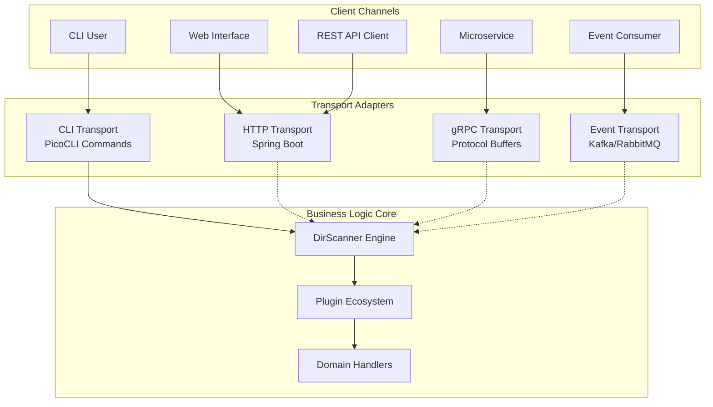

**Channel Independence Benefits:**
- **Consistent Behavior**: Same business logic across all channels
- **Reduced Duplication**: Single implementation serves multiple interfaces
- **Testing Simplification**: Test business logic once, transport adapters separately
- **Enterprise Integration**: Easy addition of new channels without core changes

## Two-Axis Separation Strategy

The framework implements a sophisticated **two-axis separation** that provides multiple dimensions of scalability and maintainability:

### Horizontal Axis: Core → Plugins
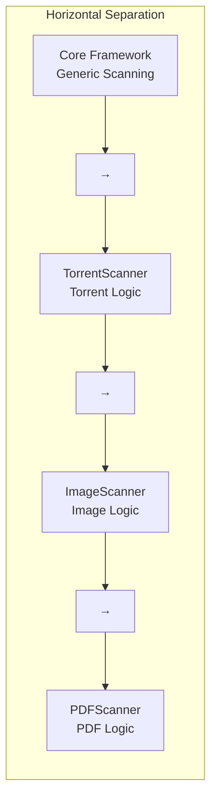

### Vertical Axis: Business Logic → Transport
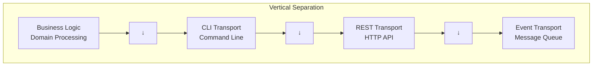

### Combined Multi-Dimensional Matrix
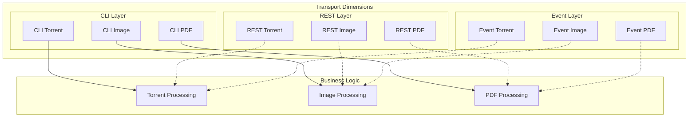

## Enterprise Architecture Readiness

### Hexagonal Architecture Integration

The framework is designed to integrate seamlessly into hexagonal (ports and adapters) architectures:

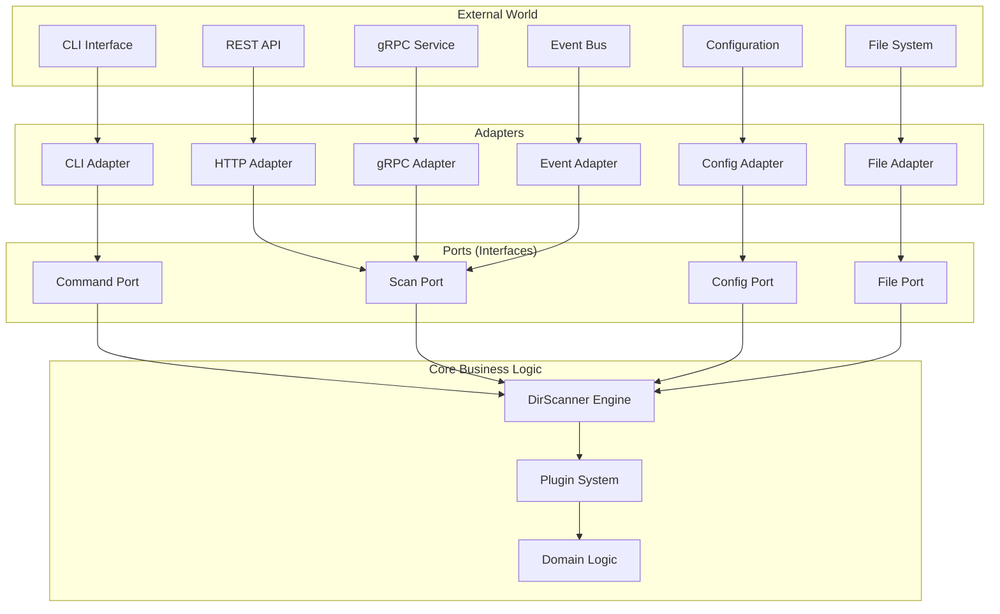

### Microservices Architecture Support

The plugin system naturally supports microservices decomposition:

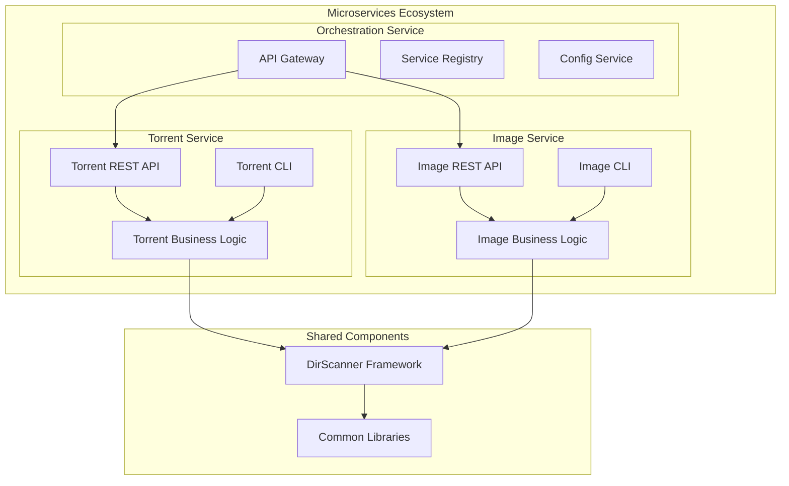

## Design Decision Rationale

### 1. ServiceLoader vs. Custom Plugin Discovery
**Decision**: Use Java ServiceLoader with extension for external JARs  
**Rationale**: 
- Standard Java mechanism for plugin discovery
- Native compilation compatibility
- Extensible for runtime loading scenarios

### 2. Transport Layer Separation
**Decision**: Complete isolation of transport concerns from business logic  
**Rationale**:
- Enables channel agnostic design
- Supports enterprise integration patterns
- Facilitates testing and maintenance

### 3. Plugin Lifecycle Management
**Decision**: Explicit initialization and shutdown with timeout handling  
**Rationale**:
- Prevents resource leaks in long-running applications
- Supports graceful degradation
- Enterprise-grade reliability requirements

### 4. Configuration as Framework Service
**Decision**: YAML-based configuration with automatic object mapping  
**Rationale**:
- Consistent configuration approach across plugins
- Type-safe configuration objects
- Environment-specific deployment support

### 5. Progress Reporting Abstraction
**Decision**: Interface-based progress reporting with transport-specific implementations  
**Rationale**:
- Decouples business logic from UI concerns
- Enables programmatic monitoring
- Supports different user interface paradigms

## Future Evolution Paths

### 1. Additional Transport Layers
- **GraphQL API**: Query-based data access
- **WebSocket**: Real-time streaming updates
- **Message Queues**: Asynchronous processing
- **gRPC Streaming**: High-performance bidirectional communication

### 2. Enterprise Features
- **Security Layer**: Authentication and authorization
- **Monitoring**: Metrics collection and observability
- **Distributed Processing**: Multi-node scanning capabilities
- **Caching**: Result caching for improved performance

### 3. Plugin Ecosystem
- **Plugin Marketplace**: Discovery and installation of community plugins
- **Plugin Versioning**: Compatibility management
- **Hot Reloading**: Dynamic plugin updates without restart
- **Plugin Dependencies**: Inter-plugin communication and dependencies

## Conclusion

The DirScanner framework architecture demonstrates a sophisticated understanding of enterprise software design principles. The two-axis separation strategy, combined with channel agnostic design, creates a foundation that can evolve to support complex enterprise requirements while maintaining clean separation of concerns and high maintainability.

The architecture's strength lies in its ability to provide **consistent business logic access** across multiple channels while maintaining **plugin-based extensibility** and **transport independence**. This makes it an excellent foundation for enterprise applications that require multiple user interfaces and integration points.