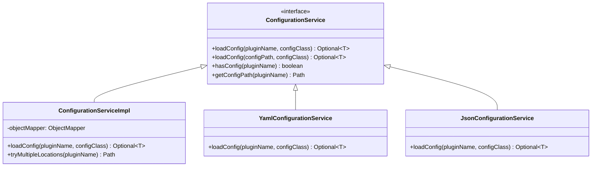

# DirScanner Framework Micro-Architecture

## Executive Summary

The DirScanner framework demonstrates a sophisticated implementation of multiple **Gang of Four (GoF) design patterns** and **Domain-Driven Design (DDD) principles** working in harmony to create a highly maintainable, extensible, and enterprise-ready architecture. This document provides a detailed analysis of how each component implements specific patterns and how these patterns collectively support the framework's architectural goals.

The micro-architecture reveals a deliberate application of **SOLID principles**, **Clean Architecture** concepts, and **hexagonal architecture** patterns that enable true **transport independence** and **channel agnostic** business logic access.

## GoF Design Patterns Implementation

### 1. Strategy Pattern - File Processing Strategies

**Implementation**: `DirScannerHandler` interface with multiple implementations

```mermaid
classDiagram
    class DirScannerHandler {
        <<interface>>
        +searchGlob() String
        +filter() Predicate~Path~
        +handleMatched(request, reporter, file)
    }
    
    class TorrentHandler {
        -torrentParser: TorrentParser
        -csvWriter: CsvWriter
        +searchGlob() "*.torrent"
        +filter() isRegularFile
        +handleMatched(request, reporter, file)
    }
    
    class ImageHandler {
        -metadataExtractor: MetadataExtractor
        +searchGlob() "*.{jpg,png,gif}"
        +filter() isImageFile
        +handleMatched(request, reporter, file)
    }
    
    DirScannerHandler <|-- TorrentHandler
    DirScannerHandler <|-- ImageHandler
```

**Benefits**:
- **Algorithm Encapsulation**: Each file type has its own processing strategy
- **Runtime Selection**: Framework selects appropriate handler based on plugin
- **Open/Closed Principle**: New file types can be added without modifying existing code

**Code Example**:
```java
// Strategy interface
public interface DirScannerHandler {
    String searchGlob();
    Predicate<Path> filter();
    void handleMatched(ScanRequest request, ProgressReporter reporter, Path file);
}

// Concrete strategy
public class TorrentHandler implements DirScannerHandler {
    @Override
    public String searchGlob() { return "*.torrent"; }
    // Strategy-specific implementation
}
```

### 2. Command Pattern - CLI Command Structure

**Implementation**: PicoCLI commands implementing `Callable<Integer>`


**Benefits**:
- **Encapsulation**: Each command encapsulates a complete operation
- **Undo/Redo Capability**: Commands can be stored and replayed
- **Dynamic Registration**: Plugins can register commands at runtime
- **Parameterization**: Commands can be configured with different parameters

### 3. Factory Pattern - Plugin and Handler Creation

**Implementation**: Multiple factory patterns at different levels


**Factory Hierarchy**:
1. **Service Factory**: `ServiceLoader` creates plugin instances
2. **Plugin Factory**: Each plugin creates its handlers
3. **Context Factory**: `PluginManager` creates plugin contexts
4. **Command Factory**: Plugins create command instances

### 4. Builder Pattern - Complex Object Construction

**Implementation**: `ScanRequest.Builder` for complex configuration

```mermaid
classDiagram
    class ScanRequest {
        -directoryPath: Path
        -outputDirectory: Path
        -indexFilePath: Path
        -dryRun: boolean
        -overwrite: boolean
        -verbosity: VerbosityLevel
    }
    
    class Builder {
        -directoryPath: Path
        -outputDirectory: Path
        -indexFilePath: Path
        -dryRun: boolean
        -overwrite: boolean
        -verbosity: VerbosityLevel
        +directoryPath(Path) Builder
        +outputDirectory(Path) Builder
        +indexFilePath(Path) Builder
        +dryRun(boolean) Builder
        +overwrite(boolean) Builder
        +verbosity(VerbosityLevel) Builder
        +build() ScanRequest
    }
    
    ScanRequest +-- Builder
```

**Benefits**:
- **Fluent Interface**: Readable object construction
- **Validation**: Build-time validation of required parameters
- **Immutability**: Creates immutable value objects
- **Default Values**: Sensible defaults for optional parameters

### 5. Template Method Pattern - Scanning Algorithm

**Implementation**: `DirScanner.scan()` defines the algorithm skeleton


**Template Structure**:
```java
public void scan(ScanRequest request) throws IOException {
    // Template method defines algorithm
    validateRequest(request);                    // Fixed step
    String glob = handler.searchGlob();         // Delegated step
    Predicate<Path> filter = handler.filter();  // Delegated step
    List<Path> files = findMatchingFiles(glob, filter); // Fixed step
    
    for (Path file : files) {
        handler.handleMatched(request, reporter, file); // Delegated step
    }
}
```

### 6. Facade Pattern - Simplified Service Interface

**Implementation**: `TorrentScanner` provides simplified interface to complex subsystem


**Facade Benefits**:
- **Complexity Hiding**: Simple interface to complex operations
- **Dependency Management**: Manages relationships between subsystems
- **Use Case Optimization**: Optimized for common usage patterns

### 7. Observer Pattern - Progress Reporting

**Implementation**: `ProgressReporter` interface with multiple implementations


### 8. Registry Pattern - Plugin Management

**Implementation**: `PluginManager` maintains registry of loaded plugins


## Domain-Driven Design (DDD) Principles

### 1. Bounded Contexts

The framework implements clear **bounded contexts** that align with business domains:


**Context Boundaries**:
- **Core Framework**: Generic file processing, plugin lifecycle, configuration
- **Torrent Processing**: BitTorrent-specific logic, torrent metadata, CSV output
- **Future Contexts**: Image processing, PDF analysis, etc.

### 2. Aggregates and Entities

**Plugin Aggregate**:


**Scan Request Aggregate**:


### 3. Domain Services

**TorrentParser Service**:
```java
@Service
public class TorrentParser {
    // Pure domain logic for torrent file parsing
    public TorrentMetadata parseTorrentFile(Path torrentFile) throws IOException {
        // BitTorrent-specific parsing logic
        // No infrastructure concerns
    }
}
```

**CsvWriter Service**:
```java
@Service  
public class CsvWriter {
    // Domain logic for CSV generation
    public void writeTorrentData(Path outputPath, List<TorrentResult> results) throws IOException {
        // RFC 4180 compliant CSV generation
        // Business rule: proper escaping and formatting
    }
}
```

### 4. Application Services

**Plugin Orchestration Service**:
```java
@ApplicationService
public class PluginManager {
    public void initializePlugins() {
        // Orchestrates plugin discovery and initialization
        // Coordinates between multiple domain services
    }
}
```

**Scanning Orchestration Service**:
```java
@ApplicationService
public class TorrentScanner {
    public void scan(ScanRequest request) throws IOException {
        // Orchestrates the complete scanning workflow
        // Coordinates between DirScanner and TorrentHandler
    }
}
```

### 5. Value Objects

The framework makes extensive use of **immutable value objects**:


## Transport Independence Implementation

### Reporter Abstraction Strategy

The framework achieves **transport independence** through strategic abstraction of progress reporting:

```mermaid
graph TD
    subgraph "Business Logic Layer"
        Handler[TorrentHandler]
        Parser[TorrentParser]
        Writer[CsvWriter]
    end
    
    subgraph "Abstraction Layer"
        Reporter[ProgressReporter Interface]
    end
    
    subgraph "Transport Implementations"
        Console[ConsoleReporter<br/>CLI Transport]
        HTTP[HttpReporter<br/>REST Transport]
        Event[EventReporter<br/>Message Transport]
        Metrics[MetricsReporter<br/>Monitoring Transport]
    end
    
    Handler --> Reporter
    Parser --> Reporter
    Writer --> Reporter
    
    Reporter <|-- Console
    Reporter <|-- HTTP
    Reporter <|-- Event
    Reporter <|-- Metrics
```

**Implementation Benefits**:
- **Single Business Logic**: Same handler code works with any transport
- **Pluggable Reporting**: Different transports provide different reporting implementations
- **Cross-Cutting Concerns**: Progress, metrics, and monitoring handled uniformly

### Configuration Service Abstraction



## Hexagonal Architecture Elements

### Port and Adapter Implementation


### Primary and Secondary Ports

**Primary Ports** (Driver Ports):
- `CommandPort`: Interface for executing scanning commands
- `ScanPort`: Interface for programmatic scanning operations
- `ProgressPort`: Interface for progress monitoring

**Secondary Ports** (Driven Ports):
- `FilePort`: Interface for file system operations
- `ConfigPort`: Interface for configuration access
- `LoggingPort`: Interface for logging operations

## Enterprise Patterns Implementation

### Dependency Inversion Principle


### Plugin Architecture with Inversion of Control


## Component Pattern Analysis

### 1. DirScanner Core Engine

**Patterns Used**:
- **Template Method**: Defines scanning algorithm skeleton
- **Strategy**: Delegates file-specific processing to handlers
- **Facade**: Simplifies complex scanning operations

**Architecture Role**:
- **Orchestrator**: Coordinates between plugins and transport layers
- **Stable Interface**: Provides consistent scanning API
- **Extension Point**: Allows plugin-based customization

### 2. Plugin Management System

**Patterns Used**:
- **Registry**: Maintains collection of loaded plugins
- **Factory**: Creates plugin instances and contexts
- **Service Locator**: Discovers plugins via ServiceLoader
- **Lifecycle Manager**: Manages plugin initialization and cleanup

**Enterprise Benefits**:
- **Dynamic Loading**: Supports runtime plugin discovery
- **Isolation**: Plugins operate in isolated contexts
- **Fail-Safe**: Plugin failures don't crash the framework

### 3. Configuration Management

**Patterns Used**:
- **Strategy**: Multiple configuration sources (YAML, JSON, properties)
- **Factory**: Creates configuration objects from various sources
- **Null Object**: Returns empty optionals for missing configurations

**Design Benefits**:
- **Environment Flexibility**: Different config sources for different environments
- **Type Safety**: Automatic mapping to strongly-typed objects
- **Non-Failing**: Never fails on missing configuration

### 4. Progress Reporting System

**Patterns Used**:
- **Observer**: Multiple reporters can observe the same events
- **Strategy**: Different reporting strategies for different transports
- **State**: Maintains scanning state and statistics

**Transport Independence**:
- **Abstraction**: Business logic doesn't know about UI details
- **Pluggability**: New transport layers can provide custom reporters
- **Consistency**: Same events reported regardless of transport

## Future Pattern Extensions

### 1. Chain of Responsibility - Processing Pipeline


### 2. Visitor Pattern - Multi-Format Output


### 3. Decorator Pattern - Enhanced Handlers


## Pattern Synergy and Architectural Coherence

### How Patterns Work Together

1. **Strategy + Template Method**: Template method defines the algorithm, strategy provides the variations
2. **Factory + Registry**: Factory creates objects, registry manages their lifecycle
3. **Observer + Command**: Commands execute operations, observers report progress
4. **Builder + Value Object**: Builder creates complex immutable objects safely
5. **Facade + Adapter**: Facade simplifies interface, adapters handle transport specifics

### Enterprise Architecture Enablement

The micro-architecture patterns collectively enable:

- **Separation of Concerns**: Each pattern addresses a specific architectural concern
- **Open/Closed Principle**: New functionality via plugins, no core modification
- **Dependency Inversion**: High-level modules don't depend on low-level details
- **Single Responsibility**: Each component has one reason to change
- **Interface Segregation**: Clients depend only on interfaces they use

## Conclusion

The DirScanner framework's micro-architecture demonstrates a masterful application of design patterns and DDD principles that work synergistically to create a robust, maintainable, and extensible enterprise-grade system. The careful application of these patterns enables the framework's key architectural goals:

1. **Transport Independence**: Business logic completely isolated from UI concerns
2. **Plugin Extensibility**: Clean extension points for new functionality
3. **Channel Agnostic Design**: Same business logic accessible through multiple interfaces
4. **Enterprise Integration**: Ready for hexagonal architecture and microservices
5. **Maintainability**: Clear separation of concerns and well-defined boundaries

The patterns implementation demonstrates that sophisticated architecture doesn't require complex frameworks - it requires thoughtful application of fundamental design principles and patterns working in harmony.